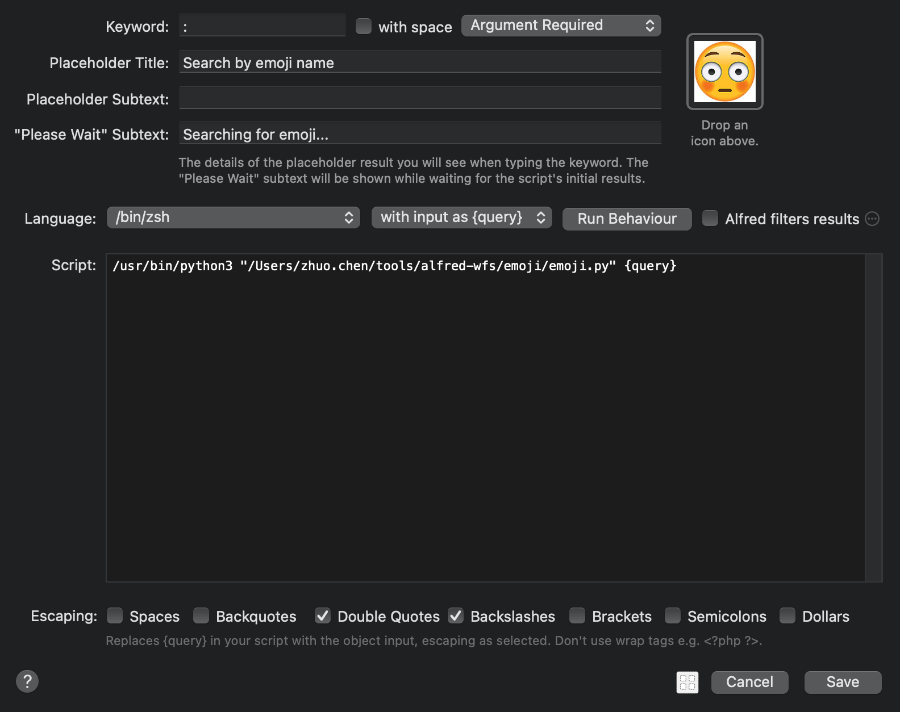

# alfred-emoji

Provide a script for quickly searching for emojis on [emojipedia](https://emojipedia.org/).

**Python3 required**


## Usage
1. Install *requests* and *Beautiful Soup 4* with
  ```shell
  pip3 install -r requirements.txt
  ```

2. Setup a `Script Filter` workflow in Alfred that calls the script `emoji.py`. The trigger can be `:` or anything you like.

For example:



3. With your wanted emoji selected, press `Cmd + C` to copy it.
